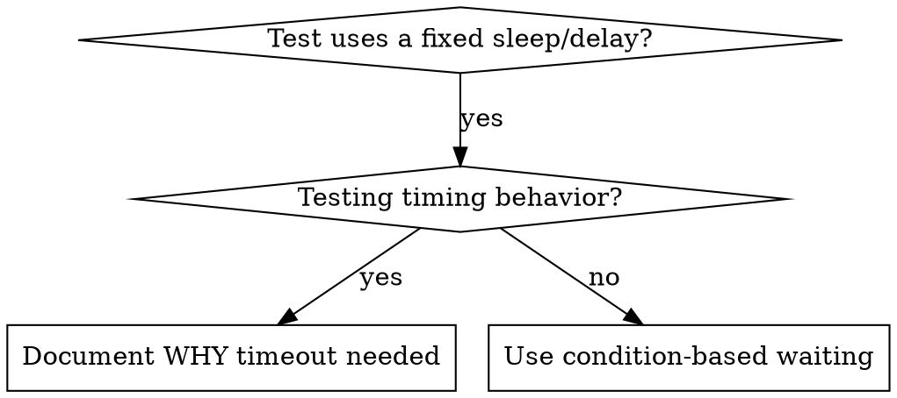

# Condition-Based Waiting

> Examples below are language-neutral pseudocode.

## Overview

Flaky tests often guess at timing with arbitrary delays. This creates race conditions where tests pass on fast machines but fail under load or in CI.

**Core principle:** Wait for the actual condition you care about, not a guess about how long it takes.

## When to Use



**Use when:**
- Tests use arbitrary fixed delays (a `sleep`/`wait N ms` regardless of what's actually happening)
- Tests are flaky (pass sometimes, fail under load)
- Tests time out when run in parallel
- Waiting for async operations to complete

**Don't use when:**
- Testing actual timing behavior (debounce, throttle intervals)
- Always document WHY if using an arbitrary timeout

## Core Pattern

```text
# ❌ BEFORE: guessing at timing
wait_fixed(50ms)
result = get_result()
assert result is set

# ✅ AFTER: wait for the actual condition
wait_for(() -> get_result() is set)
result = get_result()
assert result is set
```

## Quick Patterns

| Scenario | Pattern |
|----------|---------|
| Wait for event | `wait_for(() -> some event in events has type == DONE)` |
| Wait for state | `wait_for(() -> machine.state == "ready")` |
| Wait for count | `wait_for(() -> items.length >= 5)` |
| Wait for file | `wait_for(() -> file_exists(path))` |
| Complex condition | `wait_for(() -> obj.ready and obj.value > 10)` |

## Implementation

Generic polling function:

```text
function wait_for(condition, description, timeout = 5000ms):
    start = now()
    loop forever:
        result = condition()
        if result is truthy:
            return result
        if now() - start > timeout:
            fail("Timeout waiting for " + description + " after " + timeout)
        wait_fixed(10ms)        # poll interval — small but not zero
```

## Common Mistakes

**❌ Polling too fast:** poll every 1ms — wastes CPU
**✅ Fix:** poll every ~10ms

**❌ No timeout:** loop forever if the condition is never met
**✅ Fix:** always include a timeout with a clear error

**❌ Stale data:** cache the state once before the loop
**✅ Fix:** call the getter inside the loop for fresh data

## When Arbitrary Timeout IS Correct

```text
# Tool ticks every 100ms — need 2 ticks to verify partial output
wait_for_event(manager, TOOL_STARTED)   # first: wait for the triggering condition
wait_fixed(200ms)                        # then: wait for the timed behavior
# 200ms = 2 ticks at 100ms intervals — documented and justified
```

**Requirements:**
1. First wait for the triggering condition
2. Based on known timing (not guessing)
3. Comment explaining WHY

## Real-World Impact

From a debugging session (2025-10-03):
- Fixed 15 flaky tests across 3 files
- Pass rate: 60% → 100%
- Execution time: 40% faster
- No more race conditions
