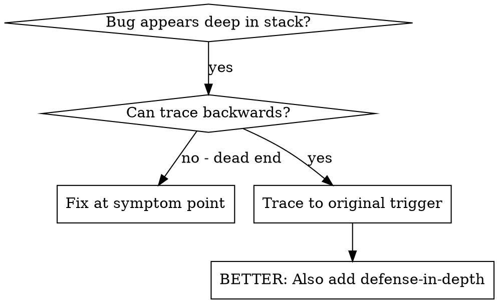
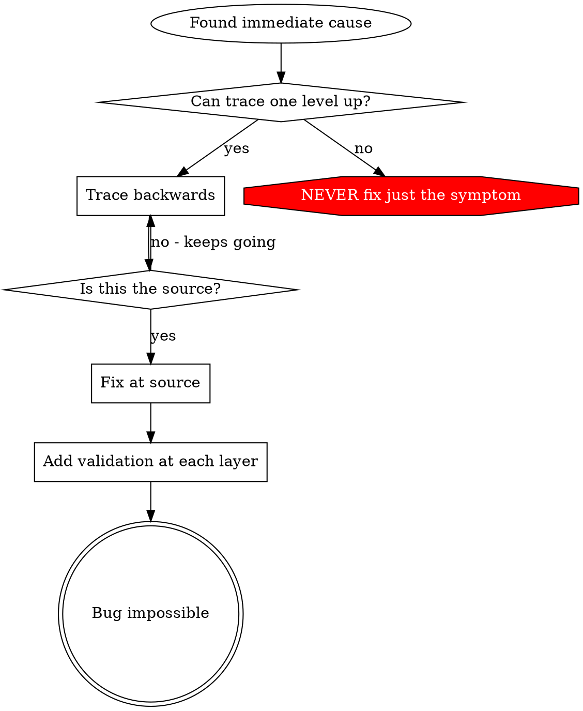

# Root Cause Tracing

> Examples below are language-neutral pseudocode.

## Overview

Bugs often manifest deep in the call stack (git init in the wrong directory, file created in the wrong location, database opened with the wrong path). Your instinct is to fix where the error appears, but that's treating a symptom.

**Core principle:** Trace backward through the call chain until you find the original trigger, then fix at the source.

## When to Use



**Use when:**
- Error happens deep in execution (not at the entry point)
- Stack trace shows a long call chain
- Unclear where the invalid data originated
- Need to find which test/code triggers the problem

## The Tracing Process

### 1. Observe the Symptom
```
Error: git init failed in ~/project/packages/core
```

### 2. Find the Immediate Cause
**What code directly causes this?**
```text
run("git", ["init"], cwd = project_dir)
```

### 3. Ask: What Called This?
```text
WorktreeManager.createSessionWorktree(project_dir, session_id)
  ← called by Session.initializeWorkspace()
  ← called by Session.create()
  ← called by the test at Project.create()
```

### 4. Keep Tracing Up
**What value was passed?**
- `project_dir = ""` (empty string!)
- An empty string as `cwd` resolves to the current working directory
- That's the source-code directory!

### 5. Find the Original Trigger
**Where did the empty string come from?**
```text
context = setup_core_test()              # returns { temp_dir: "" }
Project.create("name", context.temp_dir) # accessed before the per-test setup ran!
```

## Adding Stack Traces

When you can't trace manually, add instrumentation:

```text
# Before the problematic operation
function git_init(directory):
    emit_diagnostic("DEBUG git init", {
        directory: directory,
        cwd: current_working_dir(),
        test_mode: running_in_test_mode(),
        stack: current_stack_trace(),
    })
    run("git", ["init"], cwd = directory)
```

**Critical:** write diagnostics to a stream the test runner won't suppress (e.g. stderr), not a logger that may be silenced under test.

**Run and capture:**
```bash
<your-test-command> 2>&1 | grep 'DEBUG git init'
```

**Analyze stack traces:**
- Look for test file names
- Find the line number triggering the call
- Identify the pattern (same test? same parameter?)

## Finding Which Test Causes Pollution

If something appears during tests but you don't know which test:

Use the bisection script `find-polluter.sh` in this directory:

```bash
./find-polluter.sh '.git' '<your-test-file-glob>'
```

Runs tests one-by-one, stops at the first polluter. See the script for usage.

## Real Example: Empty projectDir

**Symptom:** `.git` created in `packages/core/` (source code)

**Trace chain:**
1. `git init` runs in the current working directory ← empty cwd parameter
2. WorktreeManager called with empty projectDir
3. Session.create() passed an empty string
4. Test accessed `context.temp_dir` before the per-test setup ran
5. `setup_core_test()` returns `{ temp_dir: "" }` initially

**Root cause:** Top-level variable initialization accessing an empty value

**Fix:** Made temp_dir an accessor that fails if read before the per-test setup ran

**Also added defense-in-depth:**
- Layer 1: Project.create() validates the directory
- Layer 2: WorkspaceManager validates not empty
- Layer 3: test-mode guard refuses git init outside the temp dir
- Layer 4: Stack-trace logging before git init

## Key Principle



**NEVER fix just where the error appears.** Trace back to find the original trigger.

## Stack Trace Tips

**In tests:** write to an unsuppressed stream (e.g. stderr), not a logger that may be silenced
**Before the operation:** log before the dangerous operation, not after it fails
**Include context:** directory, cwd, environment/mode, timestamps
**Capture the stack:** a captured stack trace shows the complete call chain

## Real-World Impact

From a debugging session (2025-10-03):
- Found root cause through a 5-level trace
- Fixed at source (accessor validation)
- Added 4 layers of defense
- 1847 tests passed, zero pollution
